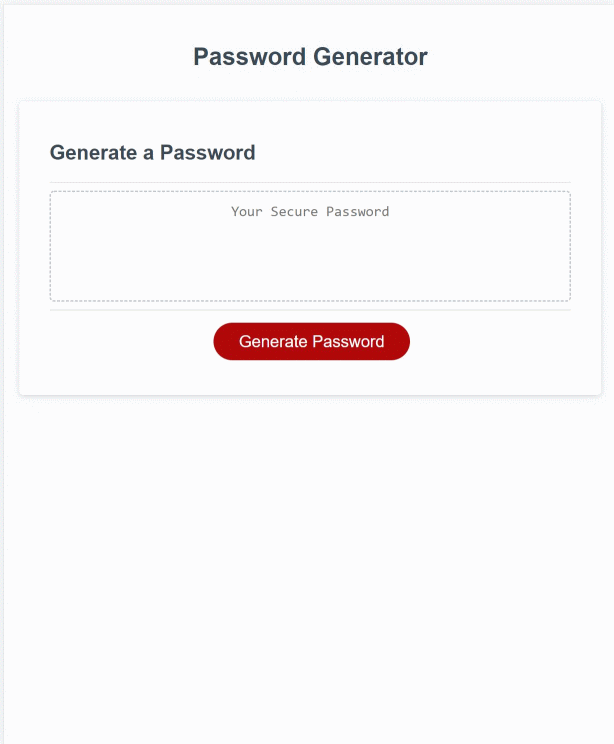

# DU-HW3-Password-Generator

DU Coding Bootcamp Homework 3: Password Generator

# Website

This is a website with a form to generate a password.

Public Website Address: https://gittinit6.github.io/DU-HW3-Password-Generator/

## Purpose

This website is specific to anyone that wants a computer generated random password based on selected criteria of:
* Password Length: 8 - 128 characters
* Password Complexity: uppercase, lowercase, special characters, and numbers

## Audience

The intended audience is an individual that would have a need for a secure and truly random password generated. The user of this site does not need to have a technical background, but *should* understand some technical terms due to the nature of a password (i.e. special characters, numeric, etc. )

## Technical Detail

This website uses HTML with an external linked CSS for style and external linked JavaScript code for functionality.

**Responsive Design:** This website is designed to be responsive to smaller screens.

The files are configured as follows:
```
Root Directory
│
│ --index.html
│
└───assets (folder)
    │
    └─── css (folder containing css style files)
    │
    └─── images (folder containing all image resources)
    │
    └─── scripts (folder containing JavaScript files)
```
>**CSS**: This site uses a single CSS file "style.css"
>**JavaScript**: This site uses a single JavaScript file "script.js"

The following image shows a screenshot of the website homepage:



## Revision History 

1. This website was created in January 2022 as part of a bootcamp assignment. It was created using starter code provided by the instructor.